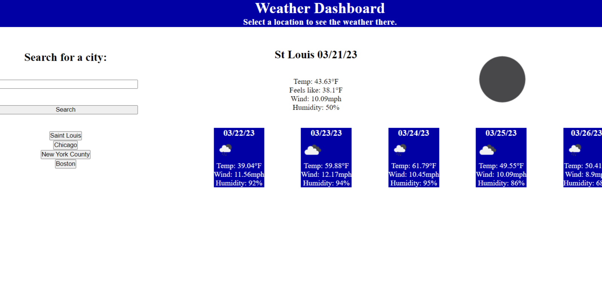

# Weather-Dashboard

## Description

This was the sixth assignment given to me by the Wash U Coding Boot Camp. The assignment was to create a weather dashboard webpage where users can search for a city and see the current weather, along with a 5 day forecast, for that city, and for there to be buttons for previous searches that appear after each search.

Working on this challenge, as always, gave me more practice and experience with creating a webpage from scratch, as well as with DOM manipulation, DayJs, and returning to vanilla js after working with jQuery for a while, and search as a rich first real experience in working in server-side APIs. Getting the API to successfully do what I wanted it to so that I could display the information on my page proved to be one of the most challenging parts of this assignment for me, but a valuable experience, especially going forward into group projects. 

## Installation

N/A, it's a webpage.

## Usage

The webpage can be found [here](https://wolfspiderman.github.io/Weather-Dashboard/).

When the user loads the page, there won't be much to see at, but if they have previous searches, the buttons for easy re-searching will be found under the search bar and accompanying button. Once they type in a city and press the search button, they will see a larger display for the current weather conditions, including temperature, wind, and humidity, along with an icon displaying the current conditions. Upon searching a city for the first time, the user will also see a button appear under the search bar with the name of the city they just searched for. The button pulls its name from the search result itself, in case there was a typo or spelling error. 

The following is a screenshot of what the page looks like after a search, with a few previous searches's buttons on display.

## Credits

For this project, I used the [OpenWeather](https://openweathermap.org/forecast5) API, [DayJs](https://day.js.org/docs/en/display/format), as well as utilizing tutorials on [stackoverflow](https://stackoverflow.com/questions/10842471/how-to-remove-all-elements-of-a-certain-class-from-the-dom).

## License

Licensed under the MIT License.